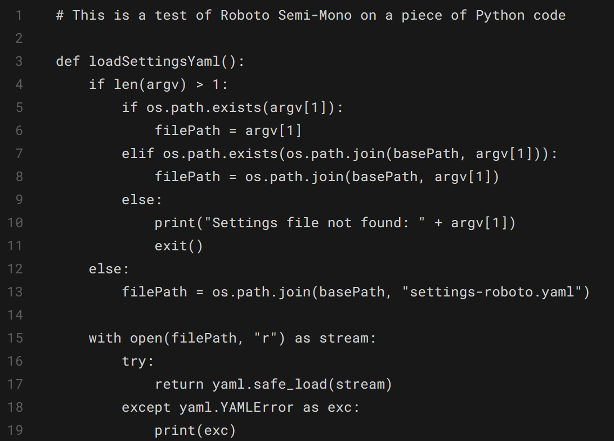
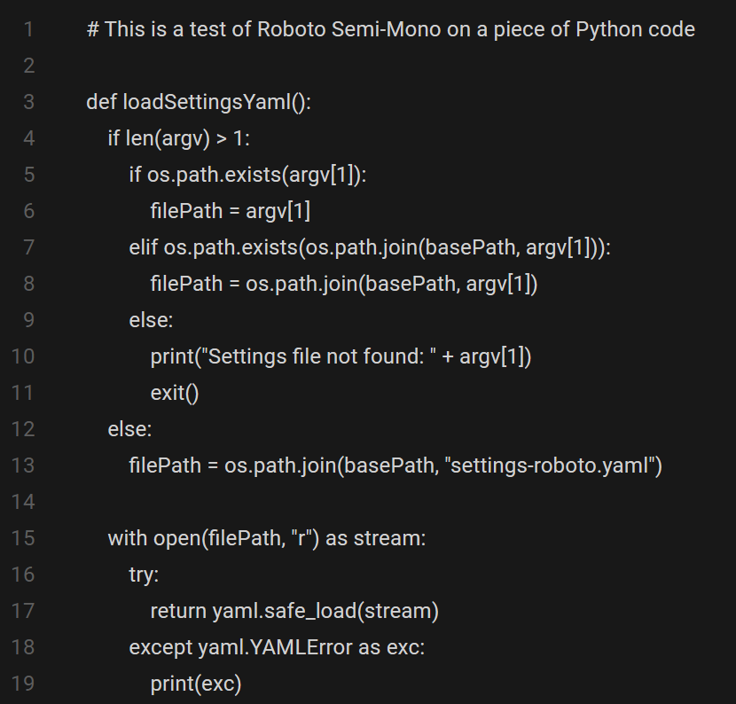
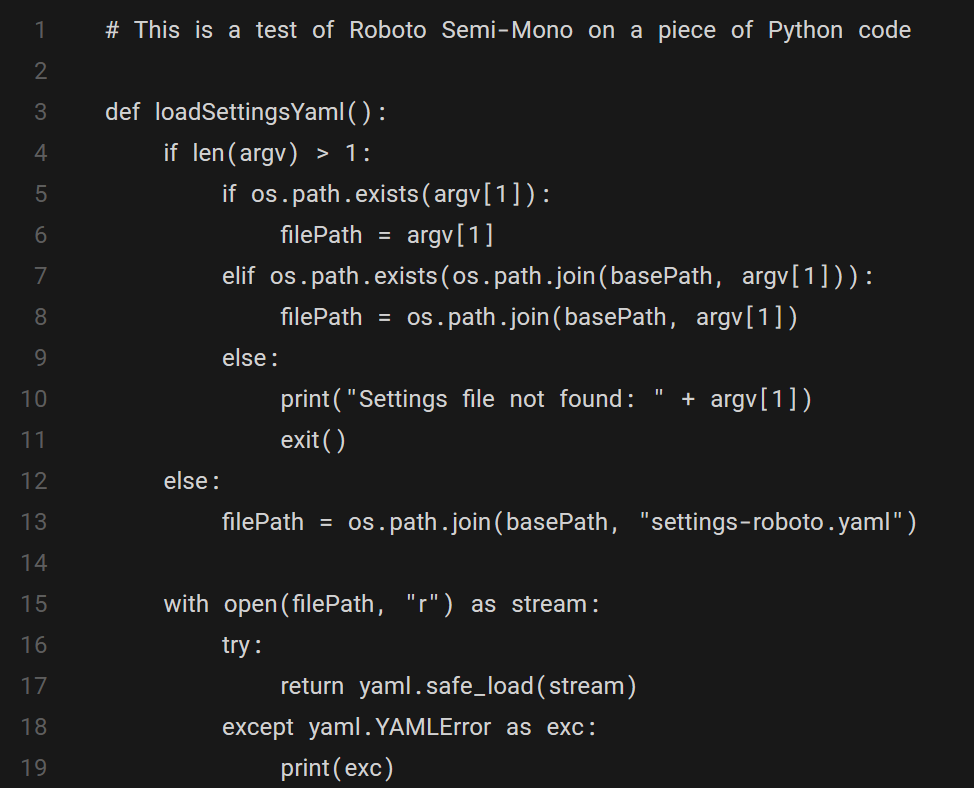
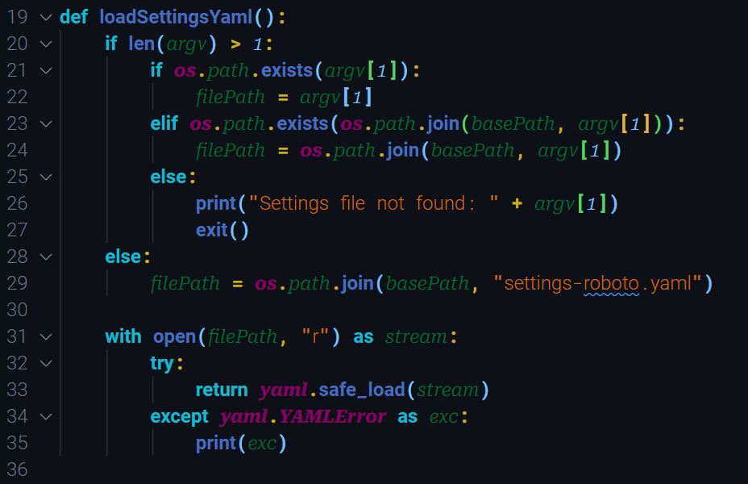

# Semi-Mono Fonts

This project is made up of two parts. First is a Python script meant for use in FontForge that will combine three different types of font into a single family:

1. A primary proportional font
2. A monospaced font for symbols and spaces
3. A proportional font for italics

We are using the wonderful [Roboto](https://fonts.google.com/specimen/Roboto) font as our base to create a new font family called **Roboto Semi-Mono**. The script can be used to create other semi-mono fonts as well.

## Why Create Roboto Semi-Mono?

Programming fonts are generally monospaced, meaning every character takes the same width. This has benefits in keeping indents and alignment consistent at the cost of a bit of readability.

### The Differences in Look

#### Monospaced

> A typical piece of code using Roboto Mono might look like this:
>
>
>*A sample of Roboto Mono*

#### Proportional

>Swap in the proportional Roboto and you get words that are easier to read but seeing and selecting punctuation and symbols becomes more difficult (line 7 is a good example):
>
>
>*A sample of the non-coding proportional Roboto*

#### Semi-Mono

>Our semi-mono script aims to give the best of both worlds - it uses a proportional font as the base and swaps in a monospace font for symbols and spaces:
>
>
>*A sample of Roboto Semi-Mono*

#### Semi-Mono with Italics

>And while we're swapping symbols, we can also swap in a different font for italics. In this case we used another member of the Robot family for italics -Roboto Serif:
>
>
>*A sample of Roboto Semi-Mono using italics and color for identification*

In this case, the italics are easy to distinguish from the regular font. [Operator Mono](https://www.typography.com/fonts/operator/overview/) and [MonoLisa](https://www.monolisa.dev/) are two fantastic monospaced fonts that use a different design for italic characters.

### When Not To Use a Semi-Mono Font

This font will work well in a lot of programming situations where we need to keep left indents consistent and predictable. However, this font will not work when there are more left aligned text in a single line, such as this example of a `struct` type in Go:

```go
struct {
    Name     string
    Capacity uint8
    Rooms    uint8
    Smoking  bool
}
```

Here we're lining up not only the name but also using a variable number of spaces to line up the type as well. I would argue that in modern day we should depend more on our programming applications to highlight the differences between types and variables, but this is a common pattern in many languages.

While we're on the subject, you might tempted to try this in a terminal application. The above use of spaces for multiple left alignments applies tenfold - definitely try it to see the chaos that ensues, but it is unlikely you'll want to use it in a terminal. 

## Installation of Roboto Semi-Mono

You can find the Roboto Semi-Mono font in the `/fonts/output` folder in TrueType (.ttf) format. It can be installed like any normal font, and will be dependent on the operating system you are using.

### Caveats for Programming Use

Some programming and terminal applications will be default only list (or show at the top) monospaced fonts. You may need to scroll down the list to find Roboto Semi-Mono.

## How to Build Your Own Fonts

Our script uses [FontForge](https://fontforge.org) and it's built-in Python interpreter to run. You can run the script locally or from a Docker container.

### Downloading the Roboto Source Fonts

We don't include the source fonts in this repo, but they should be easy to download from the the [Google Fonts site](https://fonts.google.com/).

- [Roboto](https://fonts.google.com/specimen/Roboto)
- [Roboto Mono](https://fonts.google.com/specimen/Roboto+Mono)
- [Roboto Serif](https://fonts.google.com/specimen/Roboto+Serif)

For the default script to work, these fonts should be placed unzipped into the `/fonts/original` folder - please see the [project folder structure](#project-folder-structure) below.

### Run locally

To run locally, you'll need to download and install [FontForge](https://fontforge.org/en-US/downloads/). Once installed, you can run the script from the command line:

```bash
/path/to/fontforge/bin/fontforge -lang=py -script /path/to/semi-mono/create_font.py
```

By default this will use the `settings-roboto.yaml` file. You can specify an alternate settings file:

```bash
/path/to/fontforge/bin/fontforge -lang=py -script /path/to/semi-mono/create_font.py /path/to/myFavoriteSettings.yaml
```

### Run from a Docker container

You can also run the script from a Docker container. This is useful if you don't want to install FontForge on your local machine. To do this, you'll need to have [Docker](https://www.docker.com/) installed on your machine.

#### Build the image

```bash
docker build -t semi-mono .
```

#### Run the image

```bash
docker run -v $(pwd):/tmp/fonts semi-mono
```

This will map the current directory (by using `$(pwd)`) to the `/tmp/fonts` directory in the container. The output will be in the `fonts/output` folder once the container exits. If you are a **Windows** user, you should replace the parentheses with curly braces: `${pwd}`.

You can also pass in an extra parameter to use an alternate YAML settings file:

```bash
docker run -v ${pwd}:/tmp/fonts semi-mono myFavoriteSettings.yaml
```

### Project Folder Structure

```
├── fonts
│   ├── output
│   │   ├── RobotoSemiMono-*.ttf
│   ├── saved
│   │   ├── RobotoSemiMono-*.sfd (these are FontForge files)
│   ├── source_fonts
│   │   ├── Roboto
│   │   │   ├── Roboto-*.ttf
│   │   ├── Roboto_Mono
│   │   │   ├── static
│   │   │   │   ├── RobotoMono-*.ttf
│   │   ├── Roboto_Serif
│   │   │   ├── static
│   │   │   │   ├── RobotoSerif-*.ttf
├── src
│   ├── fontCreator.py
├── yaml (local copy of PyYAML)
├── .gitignore
├── create_font.py
├── Dockerfile
├── README.md
└── settings-roboto.yaml
```

## Copyright and Trademarks

**Roboto**
: Copyright 2011 Google Inc. All Rights Reserved. Roboto is a trademark of Google. Licensed under the Apache License, Version 2.0 (http://www.apache.org/licenses/LICENSE-2.0).

**Roboto Mono**
: Copyright 2015 The Roboto Mono Project Authors (https://github.com/googlefonts/robotomono). Roboto Mono is a trademark of Google. Licensed under the Apache License, Version 2.0 (http://www.apache.org/licenses/LICENSE-2.0).

**Roboto Serif**
: Copyright 2020 The Roboto Serif Project Authors (https://github.com/googlefonts/RobotoSerif). Roboto Serif is a trademark of Google, Inc. This Font Software is licensed under the SIL Open Font License, Version 1.1. This license is available with a FAQ at: http://scripts.sil.org/OFL.

**PyYAML**
: Copyright (c) 2017-2019 Ingy döt Net Copyright (c) 2006-2016 Kirill Simonov. The PyYAML module was written by Kirill Simonov. It is now maintained by the YAML community. PyYAML is released under the MIT license. https://pyyaml.org/
